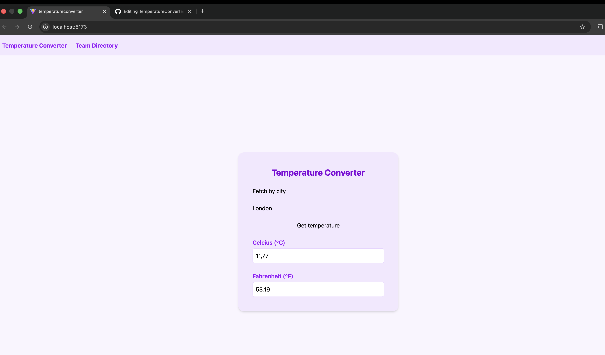

# Temperature Converter App

A React + TypeScript application built to practice core React concepts including lifting state up, controlled components, derived values, routing, and API integration.

---

#Preview



---

## Features

- Convert between Celsius and Fahrenheit in real time
- Fetch the current temperature of any city using the OpenWeatherMap API
- Team directory with search filtering
- Routing with a navbar
- Built with React, TypeScript, Vite, and Tailwind CSS

---

## Project Structure

​```
src/
  components/
    Navbar.tsx              # Navigation bar with links to both pages
    TemperatureInput.tsx    # Reusable controlled input component
    SearchBox.tsx           # Reusable search input for the directory
    EmployeeList.tsx        # Displays the filtered list of employees
  pages/
    TemperatureConverterPage.tsx   # Temperature converter with API city search
    EmployeesPage.tsx              # Team directory with search filtering
  types/
    temperature.ts          # Shared TypeScript types for the whole app
  utils/
    temperatureConversions.ts  # Single convert() function for all conversions
  App.tsx                   # Root component with routing
  main.tsx                  # Entry point, wraps app in BrowserRouter
​```

---

## Key Concepts Practiced

### Lifting State Up
State lives in the parent page component. Child components like `TemperatureInput`, `SearchBox`, and `EmployeeList` hold no state of their own. They receive values via props and communicate back to the parent via callback functions.

### Controlled Components
Every input in the app has its value driven by React state. The input never manages itself — the parent always decides what it displays.

### Derived Values
`celsiusValue`, `fahrenheitValue`, and `filteredEmployees` are never stored in state. They are computed during every render from the existing state. This keeps a single source of truth and prevents the UI from ever going out of sync.

### Single Source of Truth
Only `temperature` and `activeScale` are stored for the converter. Only `searchQuery` is stored for the directory. Everything else flows from those.

### Open/Closed Principle
The `convert()` ulitilyfunction is written so that adding a new unit like Kelvin only requires adding new cases inside that one function. No other file needs to change.

---

## Getting Started

### Prerequisites
- Node.js
- An API key from [OpenWeatherMap](https://openweathermap.org/)

### Installation

​```bash
git clone https://github.com/grad-program-projects/TemperatureConverter.git
cd temperature-converter
npm install
​```

### Environment Variables

Create a `.env` file in the root of the project:

​```
VITE_OPENWEATHER_API_KEY=your_api_key_here
​```

> Never commit your `.env` file. It is already listed in `.gitignore`.

### Running the App

​```bash
npm run dev
​```

---

## Technologies Used

| Technology | Purpose |
|---|---|
| React | UI library |
| TypeScript | Type safety |
| Vite | Build tool and dev server |
| Tailwind CSS | Styling |
| React Router | Client-side routing |
| OpenWeatherMap API | Live weather data |

---

## Environment Variables

| Variable | Description |
|---|---|
| `VITE_OPENWEATHER_API_KEY` | Your OpenWeatherMap API key |
